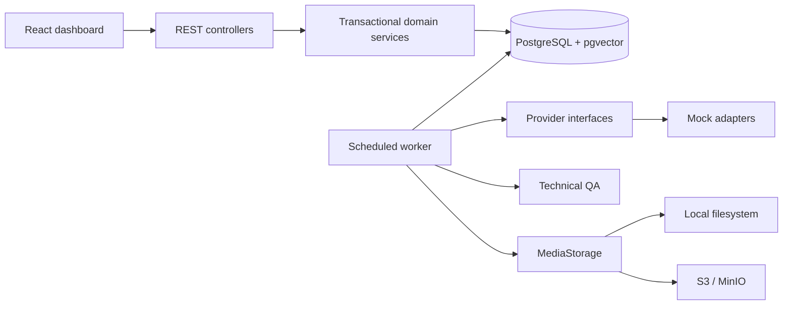

# Architecture

The foundation is a modular monolith with a PostgreSQL-backed queue. Java 21, Spring Boot 4.1.1, Gradle 9.1, PostgreSQL 17/pgvector, and S3-compatible object storage are used. Spring Boot 4.1.1 is compatible with Java 21 per the [official system requirements](https://docs.spring.io/spring-boot/system-requirements.html).

## Boundaries

- `domain` contains immutable entity snapshots and the legal generation state machine. Database relationships are explicit foreign keys, accessed through parameterized JDBC in transactional services.
- `provider` exposes ImageGenerationProvider, VideoGenerationProvider, VisionProvider, TextGenerationProvider, and UpscaleProvider. Requests, media, usage, and metadata are neutral records. Domain services have no vendor SDK knowledge. Only mock adapters are wired.
- `storage` provides create-only original writes and reads. Local writes use `CREATE_NEW`; S3 writes use `If-None-Match: *`. MinIO bucket versioning adds defense in depth. Clients receive media through the API, never credentials or raw bucket access.
- `quality` computes SHA-256 and checks file decoding, size, dimensions, aspect ratio and duplicate hashes. Duplicate detection is serialized by a transaction-scoped checksum advisory lock.
- React uses TanStack Query polling/invalidation for live metrics and actions. Nginx provides one origin for static assets and API routes.

## Transactions and delivery guarantees

Generation submission and job enqueue commit together. A transaction-scoped advisory lock serializes idempotency keys. Exact request replays return the original generation; a changed payload with the same key returns 409.

Workers claim with `FOR UPDATE SKIP LOCKED`, update the generation and job atomically, then release the transaction before rendering or storage I/O. Attempts increment on claim. Jobs carry availability time, lease token, lock time, terminal time, retry limit, failure reason, and provider metadata. Three attempts are automatic, with exponential backoff. Manual retry adds three attempts without erasing history.

Five-minute expired leases are recovered. Completion locks the job and verifies lease ownership; stale workers cannot mutate a recovered generation. This is at-least-once processing. Provider adapters must honor the stable generation operation ID before real billable calls are enabled; it is not an exactly-once external-side-effect guarantee. Future long-running adapters need bounded calls and lease heartbeat support.

Each image operation journals a provider-neutral estimate before execution, then updates to the returned usage immediately after success, before storage and result transactions. Outcome is STARTED, SUCCEEDED, or FAILED. Downstream storage failures retain successful provider usage. Failed calls without returned usage retain the estimate and a FAILED outcome; the ledger never silently omits the attempt. A process crash can leave STARTED until lease recovery. Repeated writes of the same attempt and operation are deduplicated. Real adapters must reconcile estimated/unknown billing after failures before enabling paid operations. Currently all calls are free mocks.

Object storage and PostgreSQL do not share a transaction. A crash or lost lease after object upload can leave an unreferenced immutable object. No automatic deletion risks original media; an audited orphan cleanup process is a future operational extension.

## API contract

JSON request fields use camelCase; database-backed response fields use snake_case. IDs are UUIDs and timestamps include offsets. Validation failures return 400, missing resources 404, and invalid lifecycle/idempotency conflicts 409. Lists return the latest 200 records.

| Route | Methods / behavior |
|---|---|
| /api/projects | GET, POST `{name,description}` |
| /api/collections | GET, POST `{projectId,name}` |
| /api/concepts | GET, POST `{collectionId,name,prompt}` |
| /api/generations | GET, POST `{conceptId,prompt,width,height}` + `Idempotency-Key` |
| /api/assets | GET |
| /api/assets/{id}/content | GET original media |
| /api/assets/{id}/regenerate | POST + `Idempotency-Key` |
| /api/reviews | GET, POST `{assetId,decision,reason}` |
| /api/jobs | GET |
| /api/jobs/{id}/retry | POST, failed jobs only |
| /api/dashboard | GET UTC daily counters, all-time USD cost, live job totals |
| /api/providers | GET mock capabilities |
| /api/costs | GET operation ledger |

The seven core resource routes also support GET by ID. Deletion is deliberately absent to retain originals and audit lineage. Review decisions are append-only and may only act on `QA_PENDING` assets. A technical rejection must be regenerated, not overridden.

## Operations

Actuator exposes health/info and liveness/readiness. Compose health gates PostgreSQL, MinIO, initialization, backend and frontend startup. App images run non-root. PostgreSQL and MinIO data use named volumes. API authentication and multi-tenant access are not part of this foundation: keep the supplied localhost binding or add a trusted authenticated gateway.
