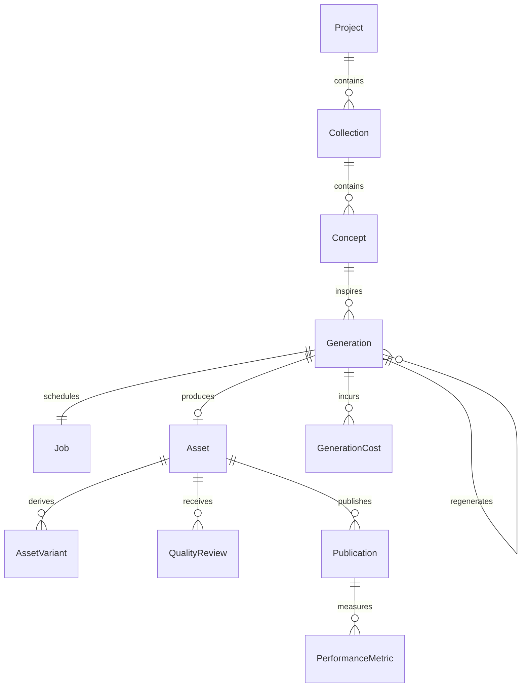
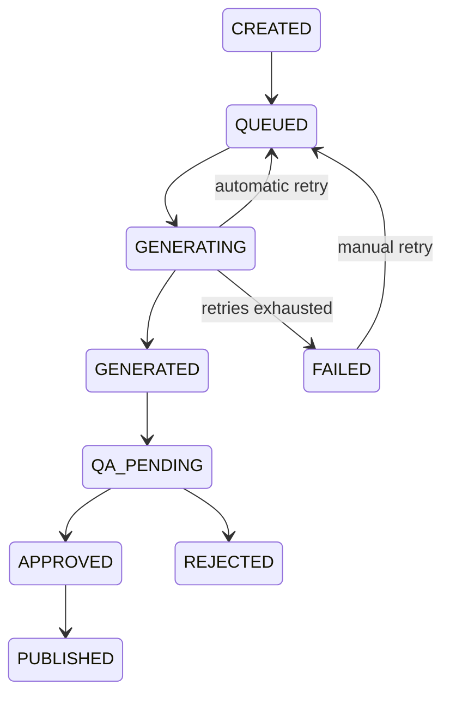

# Domain model

TASK-02 adds `GenerationAttempt` (many per Generation/Job), links each new GenerationCost to its attempt, and stores route/request/result snapshots on Generation. Job adds route index, per-provider count, dispatch gate and recovery-required state. Provider runtime/permits/request-events are infrastructure tables. Existing entities and relationships are retained; see [resilience](resilience.md) for current delivery guarantees.

UUID primary keys identify each entity. Foreign keys enforce ownership, and no cascading deletion of media records is exposed. `Generation` snapshots the prompt/dimensions so later concept edits cannot change a queued request. A regeneration points to its parent while producing a separate original.

`Asset` stores immutable storage key, SHA-256, MIME type, byte count, width and height. A generation has at most one original. Checksums are indexed but not unique: duplicate outputs remain auditable and receive a technical rejection. `AssetVariant` has its own immutable key/checksum/size and a parent asset.

`QualityReview` distinguishes TECHNICAL and HUMAN decisions and retains reasons/timestamps. Technical checks record PASSED or REJECTED. Human reviews record APPROVED or REJECTED. Only a pending generation can receive a human decision, preventing two reviewers from overwriting one another.

`Publication` holds channel, external identity and time; `PerformanceMetric` stores named decimal measurements. They are persisted schema foundations without an active publishing adapter. `GenerationCost` records generation/job/attempt, provider/model/operation, input and output usage, estimated decimal cost, currency and timestamp. Uniqueness on job/attempt/operation prevents duplicate accounting writes.

`Concept.embedding` reserves a nullable pgvector(1536) embedding. No model or embedding operation runs yet; vector dimensions must be revisited when selecting a real embedding model.

## Generation lifecycle

`GENERATED` and `QA_PENDING` are advanced within the completion transaction; API observers normally see the committed pending/rejected state. PUBLISHED is reserved for a future publication service. Regenerate creates a new lifecycle, rather than resetting an approved/rejected original.
