# Prompt engine

TASK-03 makes `PromptEngine` the authoritative image prompt construction layer. It extends the existing `FactoryService`, durable job, provider router and worker; it does not introduce another generation pipeline.

```mermaid
flowchart LR
 Concept --> Template --> Version
 Version --> Variables --> Presets
 Presets --> Experiment
 Experiment --> Canonical[Canonical prompt]
 Canonical --> Route[Existing provider router]
 Route --> Adapter[Provider prompt adapter]
 Adapter --> Snapshot[Immutable prompt snapshot]
 Snapshot --> Generation[Existing generation worker]
 Generation --> Asset --> QA
```



At acceptance, the engine resolves the selected published version (including any eligible experiment), validates/defaults variables, and composes a canonical positive/negative pair. The existing router selects the route. An adaptation is frozen for each route provider in the same transaction as the generation and job. Every actual attempt references its provider snapshot. Provider clients receive the stored adapted strings; they do not construct prompts.

## Syntax and validation

`SafePromptTemplateRenderer` implements `PromptTemplateRenderer`. Only `{{variableName}}` placeholders are recognized. Names start with an ASCII letter and contain letters, digits or underscores. No expressions, object access, functions, loops, includes, HTML interpretation or executable scripting are available. Substitution is single-pass: a value containing `{{something}}`, `$1` or backslashes remains literal.

Line endings normalize to LF. Rendering otherwise preserves whitespace. Composition trims each section and joins nonempty sections with two newlines. The engine never truncates prompts silently.

Types are STRING, INTEGER, DECIMAL, BOOLEAN, ENUM and STRING_LIST. Inputs must be native JSON types; strings are not coerced to numbers/booleans. Lists render as comma-separated strings, booleans as `true`/`false`, and decimal values without scientific notation/trailing zeroes. Definitions support labels, description, display order, required/default, allowed values, numeric min/max, and length bounds. String-list length bounds count items; individual items are strings limited to 10,000 characters. Missing optional variables without defaults render and snapshot as empty strings. Explicit null does not apply a default; required null fails.

Unknown variables, duplicates, invalid defaults/types/bounds, undefined references, or malformed syntax fail with HTTP 400. `PROMPT_VARIABLE_INVALID` responses include `variable` plus the safe error detail. Publishing checks definitions/defaults and all positive/negative references. Unused definitions, empty negatives, long prompts, duplicate phrases and simple contradictory text directives are deterministic warnings. Linting never calls an LLM.

## Composition

Order is fixed: base version → selected preset revisions in request order → pipeline constraints → manual suffixes. Positive and negative channels use the same order. Variables are substituted only in the base templates; presets/constraints/suffixes are literal data. Duplicate preset selections and unknown/archived presets are errors.

Pipeline keys are `default`, `wallpaper`, and `stock`. `PromptComposer` owns their constraints: wallpaper adds vertical/centered/lock-screen composition and excludes UI/text; stock adds commercial/clean framing and excludes trademarks/logos. Snapshot composition stores the actual strings, pipeline key, manual suffixes, order and engine version. Future pipeline integrations should contribute constraints here rather than concatenate in services. These are prompt instructions, not pixel-dimension enforcement.

## Provider adaptation

`ProviderPromptAdapter` runs after canonical rendering. The OpenAI adapter merges negatives under `Avoid the following unwanted elements:`; the mock adapter uses `Negative constraints:`. Both record `NEGATIVE_CONSTRAINTS_MERGED_V1` and a warning. A provider advertising native negative support receives separate strings under `NEGATIVE_PROMPT_SEPARATE_FIELD_V1`. No negative content is silently discarded.

Adapted strings are limited to the current pipeline's 10,000 characters per channel. Preview reports exact Java string character count and a deliberately rough `ceil(characters/4)` token estimate; it is not tokenizer output or a billing prediction. Provider image options still pass TASK-02 capability validation. Disabled OpenAI can be previewed because preview does not need credentials or invoke the image endpoint.

## Snapshots and history

`rendered_prompt_snapshots` stores kind (`TEMPLATE`, `AD_HOC`, `LEGACY`), template/version IDs and number, resolved variables, exact preset revisions/fragments, composition/overrides, canonical and adapted strings, provider, strategy, warnings, experiment attribution/assignment key, and rendering time. Database triggers forbid snapshot updates/deletes and generation attribution changes. `generation_attempts.prompt_snapshot_id` associates every new exchange with its actual input.

Retries reuse stored snapshots without looking at current versions, defaults, presets or adapter output. Fallback uses another stored provider adaptation of the identical canonical pair. Normally all route adaptations are frozen up front; recovering an old route without an adaptation derives it from the historical canonical snapshot, never current template content. Regeneration copies the parent's frozen prompt/route and preserves its original attribution and assignment key; the new generation retains `parent_id`. It is a repeat of the original direction, not a fresh experiment enrollment.

V4 backfills existing raw generations as `LEGACY` with exact raw strings and no invented template attribution. Historical UI/API reads stored snapshots. The old `generations.prompt` column remains the canonical positive string for compatibility; the exact provider input is in the linked snapshot and asset request metadata. Prompt reproducibility does not guarantee identical images from nondeterministic or changed remote models.

## API examples

`POST /api/v1/prompts/render` validates and previews a stored version, including drafts:

```json
{
  "promptVersionId": "<published-or-draft-version-uuid>",
  "variables": {"subject": "cybernetic wolf", "lighting": "NEON"},
  "presets": ["AMOLED"],
  "pipeline": "wallpaper",
  "provider": "openai"
}
```

Response includes `canonical`, optional `providerAdaptation`, `resolution` and warnings. For an eligible running experiment, include `assignmentKey` and the appropriate `conceptId`/pipeline context. Preview does not persist generations, assignments, attempts or costs. `POST /api/v1/prompts/render-draft` accepts `{version: {positiveTemplate, negativeTemplate, variables}, variables: {...}, presets: [...], provider: ...}` for unsaved editor previews. Explicit stored-version validation is `POST /api/v1/prompt-versions/{id}/validate`.

`POST /api/v1/generations/images`, with an `Idempotency-Key`, accepts the same version/variable/preset fields plus `conceptId`, normal TASK-02 provider/image options, optional `experimentId`, pipeline, `manualPositiveSuffix` and `manualNegativeSuffix`. It resolves experiments using the idempotency key rather than a client-overridable assignment key. A version request must not also contain raw `prompt`/`negativePrompt`. Raw requests and the legacy endpoint remain supported as explicit ad-hoc snapshots. Idempotency replay compares original input before consulting mutable catalogue state; same-key/different-input returns 409.

`GET /api/v1/generations/{id}` adds `promptSnapshots` and immutable attribution fields. The UI shows canonical, exact provider inputs, variables, presets, overrides and experiment IDs directly from this response.

## Operating boundary

No new authentication is invented: audit identities say `local-workspace`, not a verified user. Keep the existing private deployment boundary. Lists are currently capped at 200; automatic running-experiment resolution is uncapped to avoid silently missing eligible experiments. Role-based publishing, richer linting, tokenizers, user-defined pipeline registries and analytics are future extensions.
