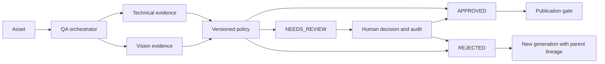

# Quality assurance

The existing generation worker stores an immutable original and atomically creates an Advanced QualityReview and QA job. It does not call Vision. The QA worker claims durable work with `FOR UPDATE SKIP LOCKED`, performs technical inspection, requests provider-neutral visual evidence, evaluates the frozen policy, and updates the generation's state. Storage reads, pixel analysis and Vision calls run outside database transactions.

## States and persistence

Execution (`PENDING`, `RUNNING`, `COMPLETED`, `FAILED`) is separate from automatic and final decisions (`APPROVED`, `NEEDS_REVIEW`, `REJECTED`). A provider/transport/schema failure ends with `FAILED`, no automatic verdict, and `NEEDS_REVIEW`. Generation states include `QA_PENDING`, `QA_RUNNING`, `NEEDS_REVIEW`; assets do not have a second, contradictory status field.

Additive migration **V5__advanced_visual_qa.sql** extends `quality_reviews`, adds `quality_findings`, `quality_dimension_results`, `qa_jobs`, `vision_qa_attempts`, `human_review_actions`, and `regeneration_requests`. `assets.current_review_id` selects the effective review. Collection policy references, QA cost associations, provider permit ownership, and publication guards are added. Existing review text, kinds and decisions survive migration; legacy `PASSED` becomes effective `NEEDS_REVIEW`, without invented AI attribution. Old migrations are unchanged.

Indexes cover queue availability, decision/execution/date filters, generation history, issue code/severity, attempt order, idempotency identities and QA cost attribution. Human audit rows cannot be changed or deleted. Policy/context snapshots and completed automated results are immutable at the database layer; historical reviews cannot be updated. Reruns create new reviews.

QA uses the existing PostgreSQL queue pattern, shared `ProviderRateLimiter`, retry decision engine, classification vocabulary, Micrometer registry and cost ledger. `qa_jobs` has a review owner because a generation can have multiple historical QA runs, whereas the original image `jobs` table intentionally retains one image job per generation. There is no second generation system.

## Technical checks

PNG/JPEG readability, MIME/decoder agreement, bounded file size, a 16 megapixel decoder limit, minimum resolution, expected dimensions, aspect ratio, alpha transparency and SHA-256 duplicates produce structured findings, including passing checks. The first asset with a checksum remains the reference; later duplicates are flagged. ImageIO header dimensions are checked before full decoding.

Near-solid content, black perimeter, clipped luminance and very low edge contrast are reproducible sampling heuristics. Their confidence is deliberately below automatic rejection confidence. They can describe intentional minimalism, silhouettes, borders, or smooth gradients; they are not claims of semantic certainty or calibrated optical blur measurements. An undecodable image skips Vision and is evaluated from conclusive technical evidence; `visual_complete=false` records that skip.

## Scheduling and cost protection

Defaults: three QA workers/concurrent provider permits, 120 requests/minute, two attempts/provider, four calls/review, twenty lifetime calls/generation, three-minute leases. Configure `VISION_*` and `QA_WORKER_CONCURRENCY` in `.env.example`; lifetime cap is Spring property `media.qa.max-generation-calls`. Queued retries persist `available_at` with exponential jitter and Retry-After. They do not sleep in a transaction. Circuit state and permits are shared across processes under a `vision:<provider>` namespace.

Authentication, invalid requests, unsupported media and invalid structured responses are permanent for that provider attempt. Retryable failures are rate limits, timeouts and unavailable services. Fallback uses the existing retry decision service and a frozen route. Ambiguous real calls do not retry/fallback by default (`VISION_RETRY_AMBIGUOUS=false`); enabling it explicitly can duplicate charges. Real-to-mock fallback is prohibited. Only one real adapter ships, so useful real-provider fallback requires adding another adapter. Tests exercise fallback with a free second adapter.

The execution gate and lease token prevent duplicate dispatches. Expired leases fail safely to human review and unknown billing instead of replaying a possibly paid call. Explicit rerun follows reconciliation. Ordinary enqueue reuses an effective review with the same asset/policy/version/provider/model/QA-prompt identity; an explicit rerun creates history. A running review is reused even when rerun is requested, avoiding concurrent duplicate calls.

Every Vision attempt creates a `generation_costs` entry with operation `VISUAL_QA`, review, asset and attempt links. Successful mock calls are zero cost. Usage and pricing uncertainty stay null/UNKNOWN for failures or custom unpriced models, never fabricated as zero. Generation detail and review detail expose combined image/QA totals grouped by currency. Actual charges remain nullable until reconciled externally.

## Publication and observability

`POST /api/v1/publications` records publication only for effective final approval. Both publication writes and transitions to `PUBLISHED` have database guards; raw SQL cannot bypass the effective-review check. Published assets cannot be re-reviewed or have their decision changed; regenerate a new asset. This endpoint records publication, it does not send media to an external channel.

Prometheus exposes QA total/approved/rejected/needs-review/execution-failed counters, duration, finding codes/severity, human overrides, Vision requests/failures/cost. Tags are bounded domain values, not asset IDs. Structured events contain review IDs and safe decisions/rules; no images, API keys, raw provider responses or full generation prompts are logged. See `/actuator/prometheus`.

The review dashboard uses current effective reviews, avoiding double-counting reruns. Today is UTC. Rates describe effective completed automated reviews and reviewed effective assets. Unknown cost counts accompany estimates.

## Verification

Run `./gradlew test integrationTest bootJar` in backend; `npm test && npm run build` in frontend. Tests use Testcontainers PostgreSQL/pgvector and loopback MockWebServer, never paid APIs. The 100-job integration test asserts bounded concurrent calls, a responsive queue, durable completion and no open transaction inside the provider call. Use `pwsh -File scripts/qa-smoke.ps1` against Compose for the full free API workflow.
