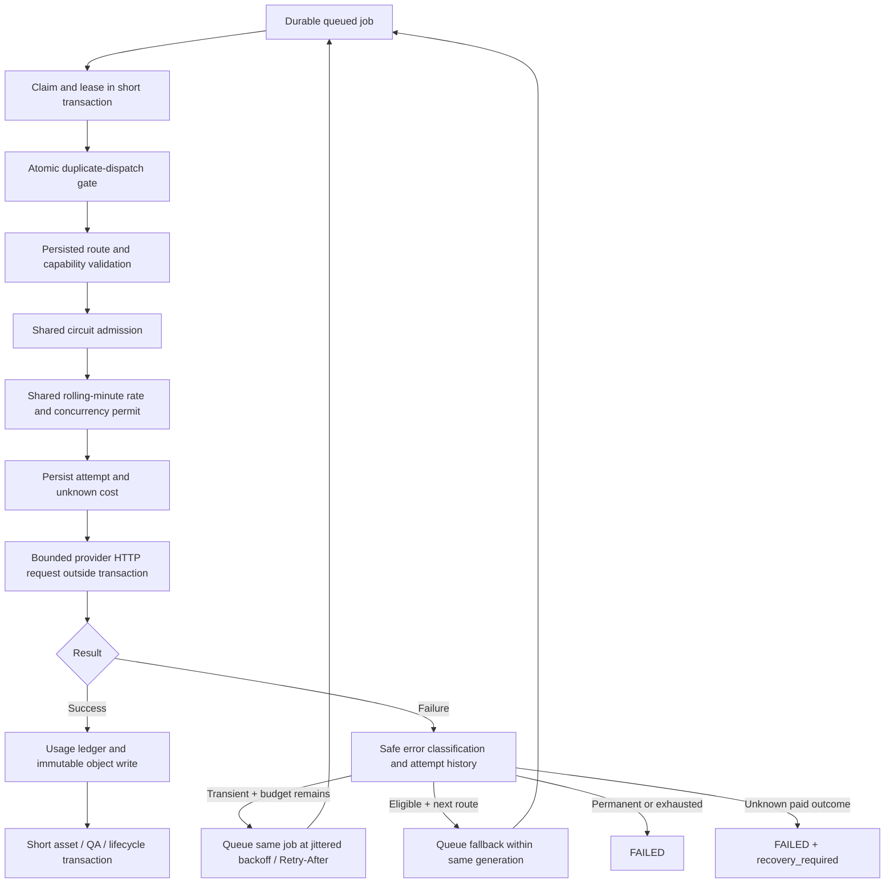

# Resilience and recovery

## Shared controls

Rate limiting and concurrency are separate. `ProviderRateLimiter` serializes admission on a provider runtime row, counts a rolling minute of request events, and grants a leased concurrency permit. These limits apply across application instances, not just threads in one JVM. Quota/concurrency waits requeue without creating billable attempt rows or incrementing attempt counters. A local bounded virtual-thread executor limits how many jobs each JVM dispatches.

All provider network calls run outside database transactions. No transaction is held during backoff, HTTP, or object storage. Provider permits are released in `finally` and expire after a crash. The request timeout plus a 90-second persistence allowance must fit inside the configured worker lease. The OpenAI timeout covers response-body completion, not just connection establishment. Response buffering is bounded and timed-out futures are cancelled.

## One retry policy

RetryDecisionService handles provider-neutral categories. RATE_LIMIT, TIMEOUT, and UNAVAILABLE are candidates. AUTHENTICATION, INVALID_REQUEST, CONTENT_POLICY and UNEXPECTED do not retry. Attempts are bounded (default three per provider); retries remain within one generation. Backoff is `min(maxDelay, initialDelay × multiplier^(attempt−1))`, with optional jitter between 50% and 100% of that value. A Retry-After duration/date sets a lower bound on the next attempt, even if longer than maxDelay. There are no nested client retry loops.

Network interruptions/timeouts can leave paid outcomes unknown. Default `OPENAI_RETRY_AMBIGUOUS=false` prevents retry/fallback in that case. `OPENAI_RETRY_AMBIGUOUS=true` deliberately permits bounded retries and may incur duplicate charges; automated timeout tests explicitly opt in against fixtures. HTTP 400/401 tests prove no retry storm. Content-policy rejections never route around the rejection.

## Circuit behavior and health

Health is passive: HEALTHY, DEGRADED, UNAVAILABLE, or DISABLED. Transient failures degrade the provider; repeated failures open a shared cooldown circuit. Authentication errors open it immediately. Invalid requests/content-policy rejections do not count against infrastructure health. Open circuits can trigger configured fallback. After cooldown only one shared half-open probe is admitted; success closes the circuit, failure reopens it. A probe is an actual queued operation, not a background paid call.

This small PostgreSQL-backed circuit reuses the existing durable queue and limiter. Resilience4j was not introduced because an in-memory parallel retry/circuit layer would duplicate the distributed policy and complicate attempt accounting.

## Idempotency and crashes

`FOR UPDATE SKIP LOCKED` claims jobs. A compare-and-set `execution_started` flag plus the lease token prevents duplicate dispatch of the same claimed job from invoking a provider twice. Completion is fenced by the same token. The OpenAI client request ID provides correlation, not guaranteed deduplication; no unsupported `Idempotency-Key` behavior is assumed.

Expired leases are detected on every scheduler cycle. If no provider attempt started, or the provider is replay-safe (mock), recovery can requeue within the existing budget. If an attempt may have called a real provider, recovery marks it failed/unknown and marks the job `recovery_required`. This includes a crash after successful provider response but before storing/committing the asset. The retry API returns 409 until `acknowledgeDuplicateRisk=true`; the details UI requires the corresponding checkbox. Reconcile the provider's request ID, billing and available result before accepting that risk.

Objects written before a lost lease/failed database commit can remain orphaned. No cleanup deletes originals automatically. A successful provider attempt remains successful in the ledger if storage fails afterward; the job fails for operator recovery rather than silently paying for another image.

## Observability

JSON structured logs include event, generation/attempt IDs, provider/model and duration for selection, attempt start/success/failure, retry, fallback, storage and completion. Raw responses/exceptions, prompts and authorization headers are excluded. Attempt history retains safe error categories/messages, request IDs, timing, fallback and ambiguity flags.

`http://localhost:8080/actuator/prometheus` exposes generation totals/success/failure, provider requests/rate limits/timeouts/fallback counters, request duration, and cost summaries. Provider/model labels come from bounded configured allowlists; cost additionally carries currency. No prompt or generation ID becomes a metric label. Counters are process-lifetime telemetry; durable history and UI statistics come from PostgreSQL.
