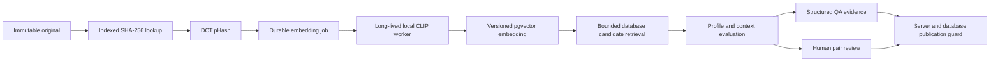

# Similarity engine

TASK-05 extends the existing image and QA workers. Originals remain in `assets`; thumbnails and other `asset_variants` never enter retrieval, backfill, or clustering. No media is deleted or overwritten.

## Boundaries and persistence

`PerceptualHash` extracts features; `ImageEmbeddingProvider` is the Java inference contract. `LocalClipEmbeddingProvider` alone knows HTTP/base64 details. `SimilarityService` retrieves candidates and persists symmetric pairs; `SimilarityPolicy` evaluates independent measurements. `SimilarityReviewService` owns optimistic human decisions and canonical selection. `CollectionClusteringService` and `DiversityGuard` consume those records.

Flyway V6 adds fingerprints, immutable model-versioned embeddings, comparisons, evaluation history, findings, duplicate families, immutable human actions, durable similarity jobs, local compute usage, versioned clustering runs, concept embeddings, and staged generation batches. V7 adds database audit guards and interactive text-operation accounting. Migrations V1–V5 are unchanged. Existing SHA checks now call the similarity engine; the legacy technical validator retains its pure boolean contract for isolated foundation tests.

Pair identity is `(min UUID, max UUID, model ID, profile ID)`. Automatic evidence, human classification, and effective classification are distinct. Additional measurements can refine an automatic evaluation; evaluation-history rows preserve previous evidence. Human judgments persist during re-analysis. Different model versions create separate historical comparisons.

## Jobs and failure semantics

An asset insert atomically creates its SHA fingerprint and active-model job. Jobs support idempotency keys, attempt counts, bounded retry, safe failure messages, availability times, lease tokens, timestamps, progress, and provider metadata. Workers claim with `FOR UPDATE SKIP LOCKED`; storage reads and inference happen outside transactions. The existing `ProviderRateLimiter` and `RetryDecisionService` are reused, with a similarity owner added to leased permits. Local inference is replay-safe; expired leases can retry. Immutable `(asset, model)` writes prevent duplicate embeddings.

Dispatch claims at most eight images, splits requests at 32 MiB of decoded input, and supports worker batches up to sixteen. The worker loads its model once. Default provider concurrency is one per shared database. Spring scheduling has four threads so CPU inference does not monopolize generation/QA dispatch. Backfill uses UUID-keyset pages of 500; it finishes only when its scope has successful analysis, and reports failed children instead of declaring coverage complete.

Analysis is `PENDING`, `READY`, or `FAILED`. Missing/failed embeddings never imply uniqueness. QA waits for pending analysis and converts exhausted analysis failures into `SIMILARITY_INCOMPLETE` evidence requiring review. Strict publication requires a successful active-model job even if a person approved QA.

## Retrieval and scale

SHA uses the existing checksum index and a fingerprint index. pHash uses pgvector HNSW `bit_hamming_ops` on `bit(64)`, queried with `<~>`. Embeddings use model-specific partial HNSW expression indexes with `vector_cosine_ops`, queried with `<=>`; cosine similarity is `1 - distance`. Vectors are L2 normalized and compatibility checked by immutable provider/model/revision/dimension/preprocessing identity. Negative cosine values are retained honestly rather than mislabeled as a probability.

Defaults: top K 50, minimum embedding similarity 0.70, HNSW `m=16`, `ef_construction=100`, query `ef_search=200`, filtered iterative search. Exact retrieval is capped at 200 representative matches per operation; a large exact family remains connected through these representatives. pHash and vector candidates are unioned and filtered before policy evaluation. The application does not scan the library's vectors per asset. Project/collection scope is applied inside vector retrieval.

This structure supports a growing library without changing the feature schema. HNSW is approximate: absence of a retrieved candidate means no match found within the configured search, not mathematical proof of uniqueness. Recall, index memory, filtered-search behavior, and latency still require measurement on a representative 100,000+ asset deployment. No such benchmark is claimed here. Clustering has a separate bounded collection limit, documented below.

## API and UI

All APIs are under `/api/v1`:

| Endpoint | Purpose |
|---|---|
| `GET assets/{id}/similar` | Source, analysis state, model identity, candidates; scope, limit, minimumSimilarity, classification |
| `POST assets/search/semantic` | `{query, limit}` shared-space text search |
| `GET similarity-comparisons` | Paginated classification/collection/date/generation-model filters |
| `POST similarity-comparisons/{id}/confirm` | Revision, classification, reason |
| `POST similarity-comparisons/{id}/mark-distinct` | Revision and reason |
| `GET similarity-comparisons/{id}/history` | Human audit history |
| `GET duplicate-groups`, `GET duplicate-groups/{id}` | Current families and originals |
| `POST duplicate-groups/{id}/canonical` | Member assetId, revision, reason |
| `GET collections/{id}/diversity` | Latest active-model run and visual families |
| `GET/POST embedding-models` | Models; discover an explicitly configured provider |
| `POST embedding-models/{id}/activate` | Switch only after complete library analysis; supports rollback |
| `GET/POST embedding-jobs` | Jobs; BACKFILL, REINDEX, CLUSTER_COLLECTION, ANALYZE_COLLECTION_DIVERSITY |
| `POST embedding-jobs/{id}/retry` | Add a bounded retry budget; preserve attempt history |
| `GET/PUT similarity-profiles/{id}` | Configurable policy thresholds with revisions (list uses `/similarity-profiles`) |
| `PUT collections/{id}/similarity-profile` | Assign policy |
| `GET similarity/dashboard` | Duplicate counts, review backlog, embedding coverage and paused batches |

The dashboard's SIMILARITY navigation contains Duplicate Review, Similarity Explorer, Collection Diversity, and Embedding Jobs. Pair review shows originals side by side, SHA, pHash, cosine, collection/concept/prompt/lineage context, and human actions. Public APIs omit embedding and centroid vectors. Model metadata and scalar metrics are exposed.

## Observability and costs

Metrics include `media_factory_embeddings_total`, `media_factory_embedding_failures_total`, `media_factory_embedding_duration`, `media_factory_similarity_queries_total`, `media_factory_similarity_query_duration`, `media_factory_exact_duplicates_total`, `media_factory_near_duplicates_total`, `media_factory_similarity_reviews_total`, `media_factory_collection_clustering_duration`, and `media_factory_embedding_backlog`. Timers export Prometheus `_seconds` suffixes. Tags use bounded provider/model/version/scope/classification values, never asset IDs or vectors. Duplicate counters count detected evaluations; dashboard SQL counts current records.

`embedding_compute_usage` records IMAGE_EMBEDDING and TEXT_EMBEDDING provider/model/revision, input count, output dimension, attempt outcome, duration, device, zero external API cost, USD currency, and unknown/null compute monetary cost. Image batch duration is attributed to each participating operation for provenance; summing these durations overstates actual worker wall time. Interactive text operations have a null job ID and independent usage ID. This is separate from paid `generation_costs`; local GPU/CPU prices are not invented.

See [embeddings](image-embeddings.md), [duplicate policy](duplicate-detection.md), [clustering](collection-clustering.md), and [diversity protection](diversity-guard.md).
