# Stock Factory

TASK-08 adds a platform-neutral stock orchestration layer to the Media Factory monorepo.

```mermaid
flowchart LR
 C[Concept] --> P[TASK-03 prompt]
 P --> G[TASK-02 generation]
 G --> Q[TASK-04 visual QA + human review]
 Q --> S[TASK-05 strict similarity]
 S --> V[TASK-06 stock JPEG + thumbnail]
 V --> T[Stock technical validation]
 T --> M[Versioned metadata]
 M --> H[Metadata QA + human approval]
 H --> E[Immutable CSV / images / manifest / report ZIP]
```



`StockProduction` references the concept, generation, source asset, processing run, stock variant, frozen profile and current metadata version. Project/collection ownership is obtained through Concept rather than duplicated. Originals stay immutable. Stock export is distinct from marketplace submission or acceptance.

The persisted lifecycle is DRAFT → SOURCE_READY → QA_PENDING → QA_APPROVED → SIMILARITY_CHECK → PROCESSING → TECHNICAL_VALIDATION → METADATA_GENERATION → METADATA_REVIEW → READY_FOR_EXPORT → EXPORTED. SOURCE_READY waits for an asynchronously queued generation if the source is not yet available. Rejection/failure states identify QA, duplicates, processing, validation, metadata or human review. Cancellation stops future orchestration; it does not delete provenance or cancel already running shared subsystem work.

Stock QA retains the existing `stock` policy's **alwaysHumanReview** rule. Inspect and approve in the existing Review workspace before processing. A second approval, in Stock Review, approves the exact metadata version for export. These gates are independent.

Workers use persisted leases, heartbeat, bounded retries and revision checks. Provider calls, image decoding and ZIP building occur outside long database transactions. Export selection and metadata versions are immutable; short transactions publish final results. Failures can be retried where safe, or rebuilt as a new export after corrections.

## Local run

Follow README model provisioning and Java/Docker prerequisites. Image, Vision and metadata providers default to free mock implementations; local CLIP and TASK-06 processing remain real local services.

```powershell
docker compose -f compose.yaml -f compose.gpu.yaml up -d --build --wait
./scripts/stock-smoke.ps1
cd frontend
npm test
npm run build
node e2e/stock-smoke.mjs
```

Use base Compose without the GPU override for CPU processing. Open http://localhost:3000 and select Stock Factory. Create a stock collection and concept, start a candidate, complete visual QA, inspect technical/metadata evidence, edit/rank keywords, approve and export.

The smoke script explicitly approves only its new mock QA fixture. It is a test harness, not an automatic approval policy for real content.

## Collections and cost

A bounded collection plan consumes existing concepts in batches. It stops at approved/exported count, pauses for metadata review, and respects maximum attempts, USD budget/reserve and TASK-05 diversity protection. Unknown/mixed-currency cost pauses dispatch. Rejected candidates remain included in cost. Paid generation/QA dispatch requires explicit positive budget and per-attempt reserve. Local processing duration is retained separately; no GPU monetary price is invented.

Initial concept authoring remains manual. The planner does not synthesize unlimited new concepts or bypass review to fill a target. `stock_collection_plans` uses collection ownership, existing clustering, and the same orchestration pattern as TASK-07.

## API

Under `/api/v1`: stock-productions (list/create/detail, approve/reject/cancel/retry), stock-productions/{id}/metadata (GET/PUT), metadata/versions, metadata/regenerate, stock-profiles and `{key}/versions`, stock-export-profiles and `{key}/versions`, stock-exports (create/list/detail, validation/content/retry/rebuild), stock-collections (create/list/production-status/produce/pause/resume/cancel), and stock-dashboard.

Create production with `{conceptId, profile}` or `{sourceAssetId, profile}` and an Idempotency-Key. Existing assets must belong to a collection configured with STOCK_STRICT. Mutations use the current revision. Profile version creation takes `{previousVersion, definition}`. Metadata regeneration takes `{revision, scope: ALL|TITLE|DESCRIPTION|KEYWORDS}`.

Deployment retains the existing private local-workspace actor model. Internet-facing or multi-user production requires authentication and authorization integration. Export technical validity does not guarantee marketplace acceptance.
