# Wallpaper production pipeline

TASK-07 coordinates the existing services. It does not implement another image generator, QA engine, embedding engine, image resizer or binary storage system.

```mermaid
flowchart LR
  Concept --> Prompt[Prompt Engine / TASK-03]
  Prompt --> Generate[Generation / TASK-02]
  Generate --> QA[Visual QA / TASK-04]
  QA --> Similarity[Similarity / TASK-05]
  Similarity --> Processing[Processing DAG / TASK-06]
  Processing --> Master[Lossless wallpaper master]
  Master --> Variants[Device variants + preview + thumbnail]
  Variants --> Package[Immutable publication package]
  Package --> Human[Human approval]
  Human --> Target[Publication target / mock]
```



AMOLED profiles add deterministic analysis after original QA and again on the processed master. Failed analysis prevents publication; no automatic black crushing is performed.

## Durable workflow

`WallpaperProduction` references Concept, Generation, original Asset, master AssetVariant and ProcessingRun. Collection and Project are resolved through Concept rather than duplicating those relationships. Profile definitions, processing version IDs and QA policy are frozen at creation. Prompt Engine renders the published wallpaper template with typed variables; underscores map the conceptual `wallpaper.*` namespace to TASK-03's supported flat variable syntax.

Transitions: CONCEPT_READY → GENERATING → QA_PENDING → QA_APPROVED → SIMILARITY_CHECK → PROCESSING → PUBLICATION_REVIEW → APPROVED_FOR_PUBLICATION → PUBLISHING → PUBLISHED. Rejection/failure states distinguish QA, duplicate, AMOLED, generation, processing and publication failures. PAUSED, CANCELLED and UNPUBLISHED retain all lineage and costs.

The scheduled worker performs one persisted stage at a time. Short transactions protect dispatch; stable generation/processing keys make replay safe. A two-minute lease bounds abandoned work. Generation, QA, similarity and processing retain their existing workers and recovery semantics. Pause prevents future stage dispatch; it does not erase already-running work. Publication and export workers use separate leases, fencing tokens and heartbeats. This is polling of durable queues, not a second calendar scheduler; future automation can call the same create/produce APIs.

Human publication approval is required and identifies an immutable package. Metadata edits invalidate approval. Reprocessing attaches a new TASK-06 run and requires a new package/review; regeneration creates a descendant production and generation. Published content must be unpublished before its processing selection changes.

## API

All paths below are under `/api/v1`:

| Endpoint | Purpose |
|---|---|
| POST `/wallpaper-productions` | Start with conceptId, profile and metadata; Idempotency-Key required |
| GET `/wallpaper-productions`, `/{id}` | Queue/detail, evidence, events, variants and packages |
| POST `/wallpaper-productions/{id}/pause`, `/resume`, `/cancel`, `/reject` | Revision and reason required |
| POST `/wallpaper-productions/{id}/regenerate` | New lineage, Idempotency-Key required |
| POST `/wallpaper-productions/{id}/reprocess` | Attach processingRunId from the same original, preserving required profiles |
| POST `/wallpaper-productions/{id}/metadata` | Revision-checked metadata edit |
| GET `/wallpaper-profiles`, `/wallpaper-device-profiles` | Profile/device registry |
| PUT `/wallpaper-profiles/{key}` | Version-checked definition change for future productions |
| GET `/wallpaper-dashboard` | Operational counts and recorded costs |

Generation dimensions remain provider-dependent. The local mock supports the seeded 1024 × 2048 portrait request. A real provider must support the chosen dimensions/options; no paid generation is used in CI or the smoke script.

## Run and verify

```powershell
./scripts/provision-processing.ps1
docker compose -f compose.yaml -f compose.gpu.yaml up -d --build --wait
./scripts/wallpaper-smoke.ps1
```

Use base Compose without the GPU override for CPU processing. Open the Wallpaper Factory navigation item at http://localhost:3000. Create a wallpaper collection, add concepts, choose a profile and start production. Review QA/similarity in their existing workspaces when intervention is required. Prepare and inspect the package, approve it, then explicitly publish to the mock catalog or export it.

See [collections](wallpaper-collections.md), [publication](wallpaper-publication.md), [AMOLED](amoled-pipeline.md), [device variants](android-wallpaper-variants.md) and the [verification report](task-07-report.md).
